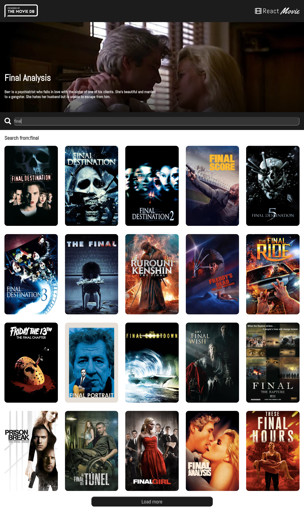

<p align="center">
  
</p>

<!-- <p>Link para visitar o site : 
<a href="https://netflix-clone-q8xyoc18a-dany679.vercel.app/" />Demo</a>
</p> -->
<p align='center'> tmdb web site<p/>

<p align="center">
  <a href="#-projeto">Projeto</a>&nbsp;&nbsp;&nbsp;|&nbsp;&nbsp;&nbsp;
   <a href="#-Tecnologias">Tecnologias</a>


<p align="center">
 

  
</p>

<br>


## 🚀 Tecnologias

Esse projeto foi desenvolvido com as seguintes tecnologias:

- java script [ecma6]
- react
- typescript
- styled components

## 💻 Projeto

O projeto o site do tmdb.

## :memo: Licença


obs: nãp tenho direito sobre nenhuma imagem 
API usada foi o tmdb 

- [tmdb](https://developers.themoviedb.org/)

# :wrench: How To Run
To run this app on your computer, run these commands inside the repository root folder

case you use npm just change to npm install pacote_name
```shell
#  install dependencies, run :
$ yarn

# start 
$ yarn start

```


---
